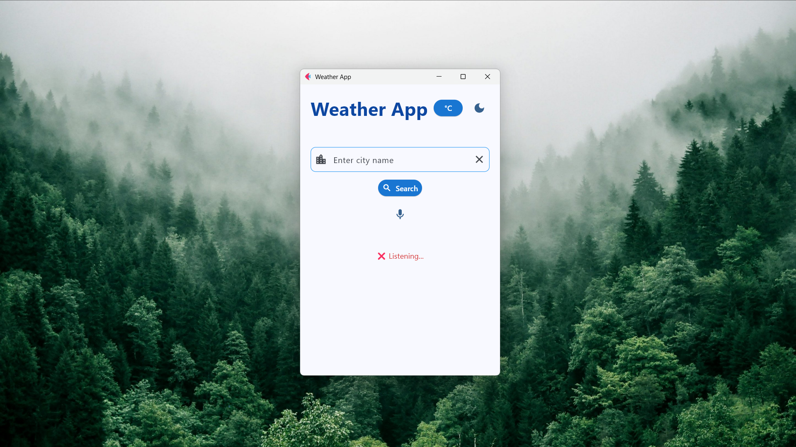
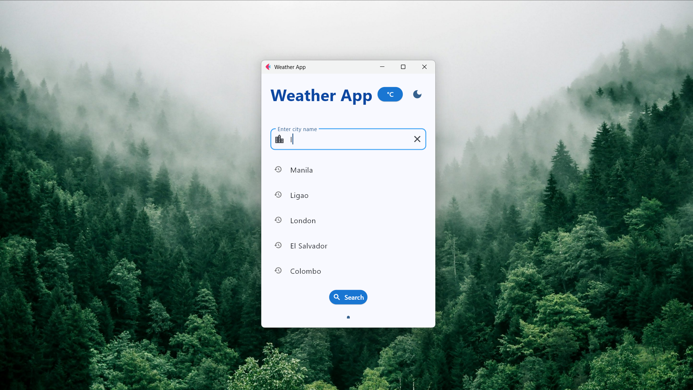
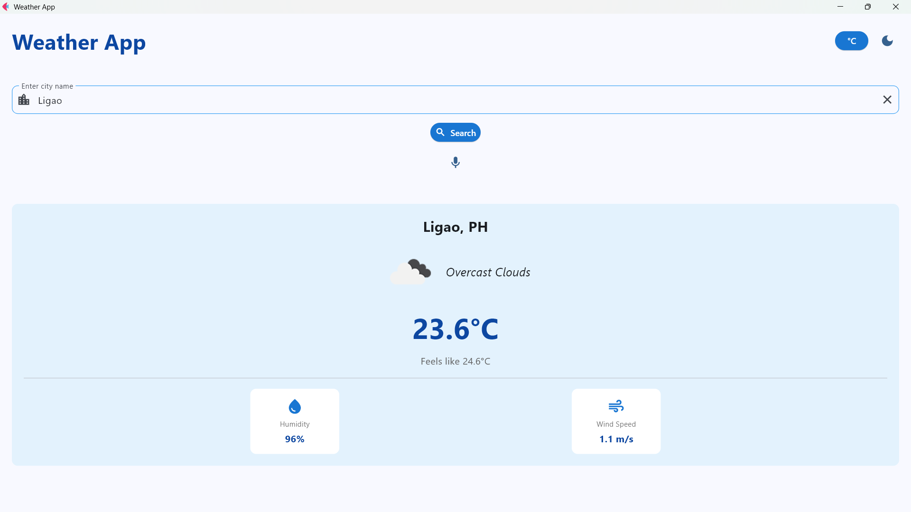

# Weather Application - Module 6 Lab

## Student Information
- **Name**: Joshua Quiobe Sario
- **Student ID**: 231004807
- **Course**: CCCS 106
- **Section**: BSCS3B 

## Project Overview
A modern Flet-based weather app that provides real-time weather updates, convert unit temparature, and supports voice search and voice feedback, allowing users to speak queries and hear weather results spoken back.

## Features Implemented

### Base Features
- [✓] City search functionality
- [✓] Current weather display
- [✓] Temperature, humidity, wind speed
- [✓] Weather icons
- [✓] Error handling
- [✓] Modern UI with Material Design

### Enhanced Features
1. **[Search History]**
   - The app automatically saves the user’s previously searched cities, allowing quick access without retyping. The history list updates dynamically and can be tapped to instantly re-fetch weather data.
   - To improve convenience and enhance user experience by reducing repeated typing. It makes the app feel smarter and more personalized.
   - The main challenge was managing persistent storage so the history does not reset every time the app closes.This was solved by implementing a search history manager that stores searches in a local file and loads them at startup. Additional logic was added to avoid duplicate entries and keep the list organized.

2. **[Unit Converter (°C ↔ °F)]**
   - Users can toggle between Celsius and Fahrenheit, and the app instantly recalculates and updates all weather values such as temperature, feels-like, and forecast data.
   - Weather apps commonly support multiple units, and this makes the app more globally accessible and user-friendly.
   - The main issue was ensuring consistent conversion across all views—current weather, forecast, and voice feedback. The solution was to create a centralized unit-conversion function so all parts of the app use the same logic, preventing mismatched values.

3. **[Voice Search & Voice Feedback]**
   - The app allows users to speak the name of a city, and the weather results are read aloud using text-to-speech. This provides a hands-free experience and enhances accessibility.
   - To make the app more interactive, modern, and inclusive—especially for users who prefer hands-free control or have difficulty typing.
   - Implementing voice search required handling speech recognition errors, accents, and background noise. This was managed by adding: retry logic, clear voice prompts, fallback text input. For voice feedback, synchronizing TTS with page updates was tricky. I solved it by triggering TTS only after the UI finished rendering the new weather results.

## Screenshots






## Installation

### Prerequisites
- Python 3.8 or higher
- pip package manager

### Setup Instructions
```bash
# Clone the repository
git clone https://github.com/<username>/cccs106-projects.git
cd cccs106-projects/mod6_labs

# Create virtual environment
python -m venv venv
source venv/bin/activate  # On Windows: venv\Scripts\activate

# Install dependencies
pip install -r requirements.txt

# Create .env file
cp .env.example .env
# Add your OpenWeatherMap API key to .env
